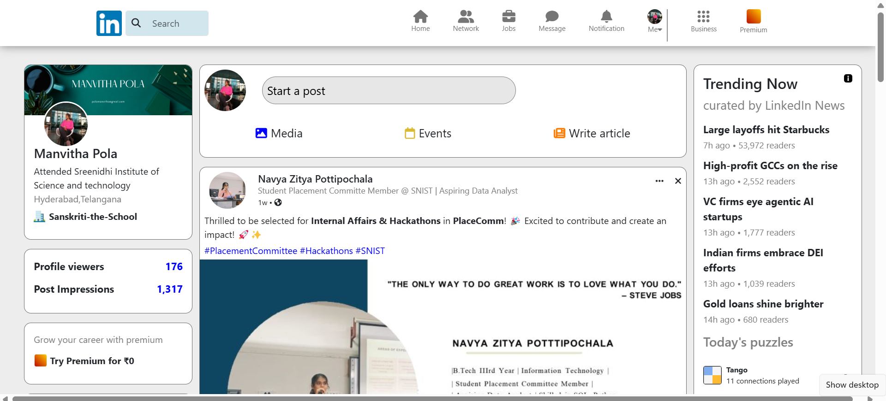
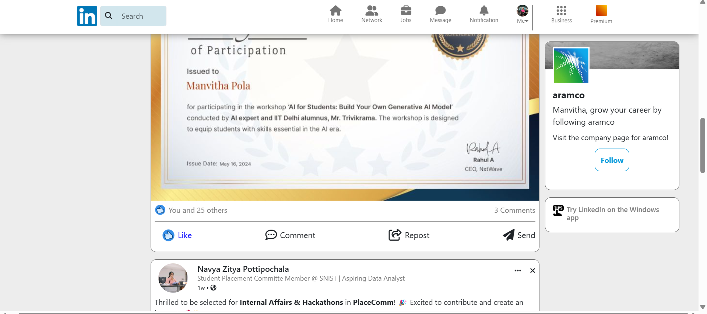

# 🔗 LinkedIn Clone  

A **LinkedIn Clone** built using **HTML, CSS, and Bootstrap**, replicating the professional networking site's **UI and responsiveness**.

## 🚀 Features  

✅ **Responsive Navigation Bar** with search & profile icons  
✅ **Hero Section** showcasing the user’s feed  
✅ **Post Section** to display user posts dynamically  
✅ **Sidebar with profile recommendations & links**  
✅ **Footer with essential LinkedIn-like links**  

## 🛠️ Technologies Used  

- **HTML5** – For structuring content  
- **CSS3** – Custom styles & UI enhancements  
- **Bootstrap 5** – Ensuring responsiveness & layout  

## 📸 Screenshots  

  
  

## 🔗 Live Demo  

👉 **Live Website:** https://manvitha-clone.netlify.app/

## 📌 Getting Started  

### 1️⃣ Clone the Repository  

git clone https://github.com/ManvithaPola/LinkedIn-clone.git
cd linkedin-clone

### 2️⃣ Open the Project  
- Simply open **index.html** in a browser to view the project.

